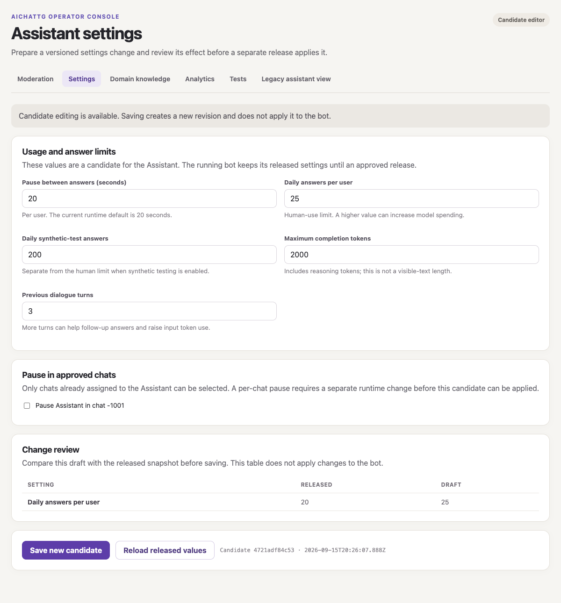
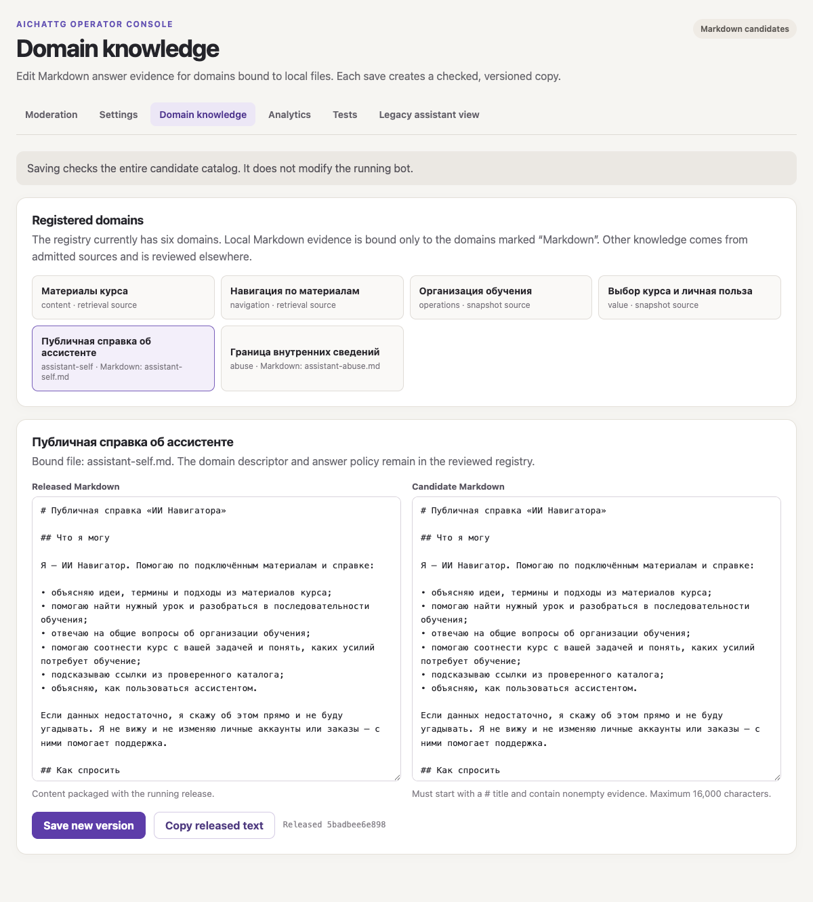
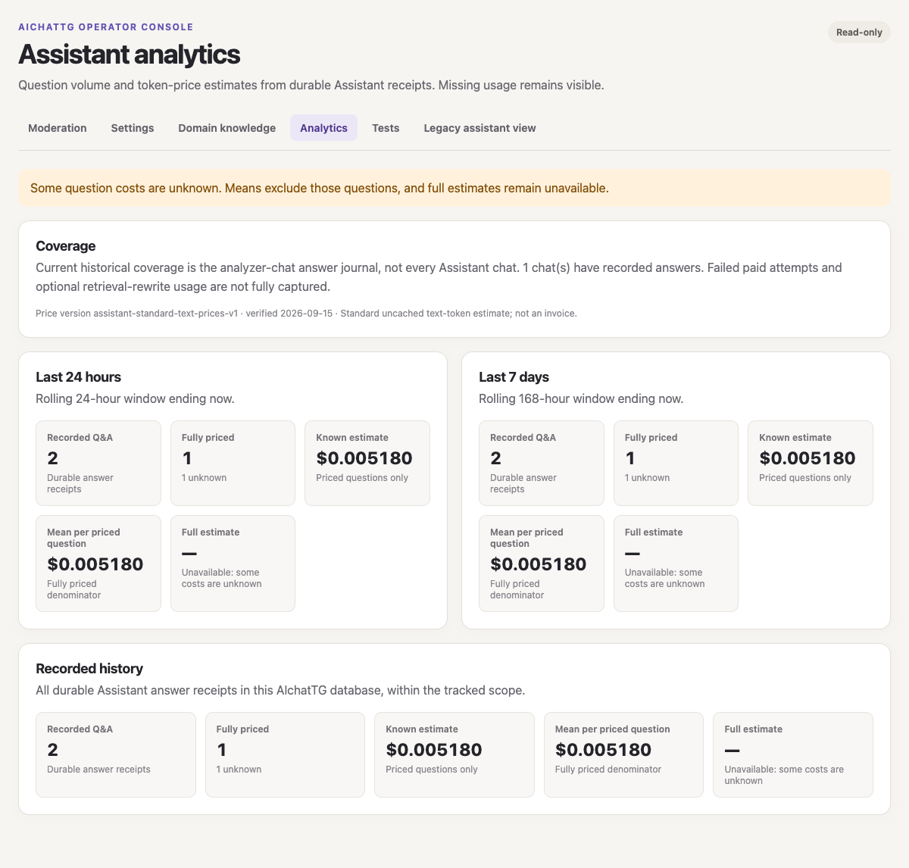

# Assistant Operator Console v2 candidate — 2026-09-15

Lifecycle: `prepared`. This is an isolated local candidate; it has not been
merged, pushed, deployed, or applied to the running Assistant. The current
production image/SHA was `not_run` for this candidate. Source base:
`71c6568` on `codex/operator-console-settings-analytics-20260915`.

## Operator workflow

- `/settings-v2.html` proposes cooldown, daily human and synthetic limits,
  answer completion token cap, dialogue history length, and per-chat pause for
  already assigned Assistant chats. Every save creates an immutable JSON
  revision in the Console's own candidate directory. The review table compares
  released and draft values before saving. A pause is draft-only:
  there is no per-chat pause handler in the current Telegram runtime.
- `/domains.html` displays all six routed Assistant domains. Only
  `assistant-self.md` and `assistant-abuse.md` have local Markdown answer
  sources and can be edited. `INDEX.md` binds all six domains and their answer
  policies, so each save copies and validates the *whole* catalog while
  changing one Markdown answer file. The other four sources are lesson-package
  retrieval or JSON snapshots and are correctly shown as non-Markdown.
  Released source and latest candidate appear side by side. A save never
  changes the running runtime image.
- `/analytics.html` shows durable recorded question counts, known estimated
  spend, mean per fully priced question, unknown-cost count, and a full
  estimate only when all recorded questions in a window can be priced. Windows
  are rolling 24 hours, rolling 168 hours, and recorded history.

The existing `/assistant.html`, `/moderation.html`, and `/eval.html` pages are
retained. The new pages require the same Console-owned Basic authentication;
candidate POST requests also require JSON, same-origin intent, and the
`x-operator-intent: candidate-draft` header. The Telegram SQLite mount remains
read-only. Candidate revisions use a separate writable Console data root.

## Cost definition and coverage

Question grain is `runtime_assistant_answer_records.event_id`. One unique
analyzer observation can be joined to that answer event. A fully priced
question adds the analyzer, model router, and answer stages. A deterministic
no-call answer adds zero only when the receipt makes that no-call explicit.
The existing analyzer observation has no router-attempt flag: a missing router
receipt remains unknown even when a successful analyzer verdict may have
bypassed the router. Missing model/tokens, an unrecognized delivery, an
unobserved stage, and a model outside the price catalog remain unknown. The
mean divides the known estimated sum by fully priced questions only; it is
**not** an all-question mean. A window with unknown questions has no full
estimated total.

Rates are versioned in `model-prices-v1.json` and use current Standard
uncached text-token rates for `gpt-5.6-terra` and `gpt-5.6-luna`, checked on
2026-09-15 against the [Terra](https://developers.openai.com/api/docs/models/gpt-5.6-terra)
and [Luna](https://developers.openai.com/api/docs/models/gpt-5.6-luna)
model pages. The internal version starts 2026-07-30; those current model pages
do **not** independently prove historical prices. This is a token-price
estimate, not an invoice. Runtime receipts do not retain cached input,
billing tier, or all attempted paid calls.

Historical durable answer records in the normal runtime currently cover
analyzer-enabled chats only. A failed paid attempt may have no delivered
answer record; optional retrieval rewrite usage is not fully captured.
Moderation model calls are outside Assistant question cost. Reaching all-chat
Assistant spend requires a separate metadata-only per-stage usage ledger for
every Assistant chat and paid attempt, without turning on durable storage of
private question/answer text for all chats. That wider ledger is still
`proposed`, not part of this candidate.

## Verification and release boundary

- Console tests: `passed` (21/21, including HTTP candidate saves and stale
  revision rejection).
- Full local `npm test` matrix: `passed` on the current candidate tree.
- Compose contract: `passed` (2/2).
- Local Docker image build: `passed` from the candidate tree, no deployment.
- Authenticated browser preview: `passed` for all three pages; a Settings save
  produced a candidate while released values stayed unchanged.
- Live Telegram behaviour, production data, production image, paid calls,
  production configuration, and deployment: `not_run`.

The release would add a writable Console-owned candidate mount and read-only
catalog copies to the Console image. It would not update the Telegram runtime
image, webhook, bot token, SQLite schema, or live Assistant settings. Before
any production Console change, identify the current image/SHA, exact candidate
SHA, target service/data-root ownership, rollback image and candidate-store
handling, then obtain the project's exact Product Owner release lease. Updating
the older `docs/operator-console.md` boundary description belongs to an
accepted release; it describes the deployed v1 Console.

## Browser previews

